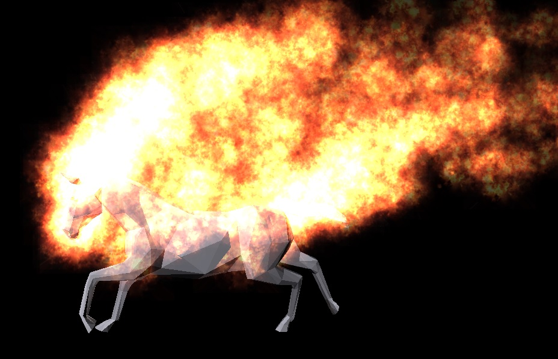

#FluidParticles.js
#### JavaScript Fluid Particle System ####

##About
자바스크립트기반의 유체파티클(Fluid Particle) 시뮬레이터 라이브러리 입니다. 이제 웹상에서도 3D 유체를 표현 할 수 있습니다. 우리는 유체의 움직임을 표현하기 위해 "Perlin Noise"기법을 적용하였습니다. 전통적인 유체 시뮬레이션 방식은 많은 연산량을 요구하기 때문에 웹기반의 실시간 어플리케이션에서는 쉽게 사용될 수 없습니다. 따라서 본 라이브러리에서는 노이지 기법을 통해 유체에서 흔히 나타나는 난류의 움직임을 구현하였습니다. 정밀한 시뮬레이션 기술 대신 심플한 기법을 통해 구현된 이 라이브러리는 웹이나 게임 같은 실시간 어플리케이션에 적합하며 안정적인 성능을 보여줍니다.

##Example
본 라이브러리를 통해 제작된 웹 어플리케이션은 아래 링크를 통해 확인 하실 수 있습니다.
[https://www.youtube.com/watch?v=iCzr-uhL1jk](https://www.youtube.com/watch?v=iCzr-uhL1jk)



##How to use
FluidParticles.js는 three.js를 기반으로 하고 있습니다.
따라서 사용전에 three.js 라이브러리를 포함해야 합니다.

```javascript
<script src="./lib/three/build/three.min.js"></script>
<script src="./lib/three/examples/js/libs/stats.min.js"></script>
```

###Initialize system
```javascript
var ps = new FluidParticles();
ps.initialize(10000);
```

###Seed particles
```javascript
var v = new THREE.Vector3();
ps.addParticlesFromSphere(20, v, 1);
```

###Update particles
```javascript
ps.updateParticles(dt);
```
